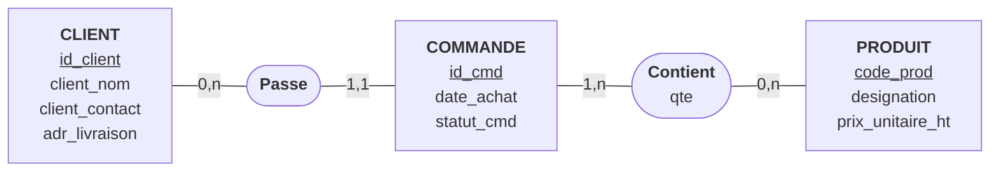

# MCD — MegaShop-B2B

```mermaid
flowchart LR
    CLIENT["<b>CLIENT</b><br/><u>id_client</u><br/>client_nom<br/>client_contact<br/>adr_livraison"]
    PASSE(["<b>Passe</b>"])
    COMMANDE["<b>COMMANDE</b><br/><u>id_cmd</u><br/>date_achat<br/>statut_cmd"]
    CONTIENT(["<b>Contient</b><br/>qte"])
    PRODUIT["<b>PRODUIT</b><br/><u>code_prod</u><br/>designation<br/>prix_unitaire_ht"]


    CLIENT ---|"0,n"| PASSE
    PASSE ---|"1,1"| COMMANDE
    COMMANDE ---|"1,n"| CONTIENT
    CONTIENT ---|"0,n"| PRODUIT
```