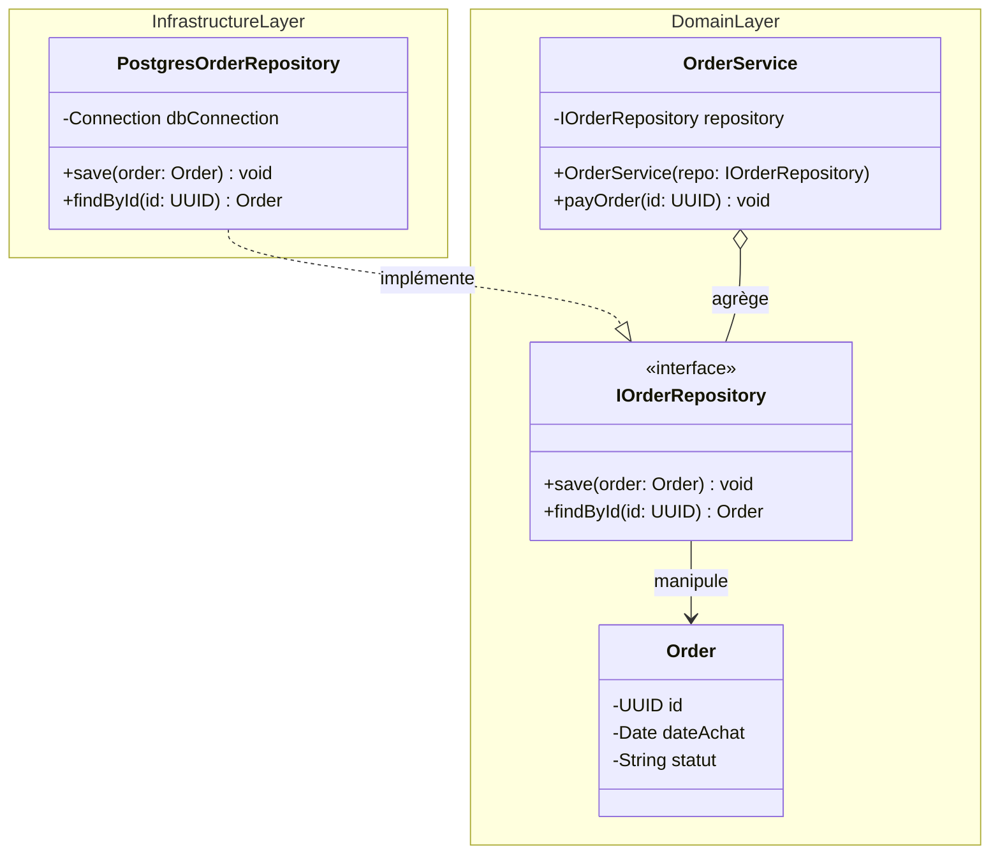

# Diagramme de classes

```mermaid
classDiagram
    %% Couche Domaine : métier pur, aucune dépendance technique
    namespace DomainLayer {
        class Order {
            -UUID id
            -Date dateAchat
            -String statut
        }

        class IOrderRepository {
            <<interface>>
            +save(order: Order) void
            +findById(id: UUID) Order
        }

        class OrderService {
            -IOrderRepository repository
            +OrderService(repo: IOrderRepository)
            +payOrder(id: UUID) void
        }
    }

    %% Couche Infrastructure : détails techniques (PostgreSQL)
    namespace InfrastructureLayer {
        class PostgresOrderRepository {
            -Connection dbConnection
            +save(order: Order) void
            +findById(id: UUID) Order
        }
    }

    PostgresOrderRepository ..|> IOrderRepository : implémente
    OrderService o-- IOrderRepository : agrège
    IOrderRepository --> Order : manipule
```
