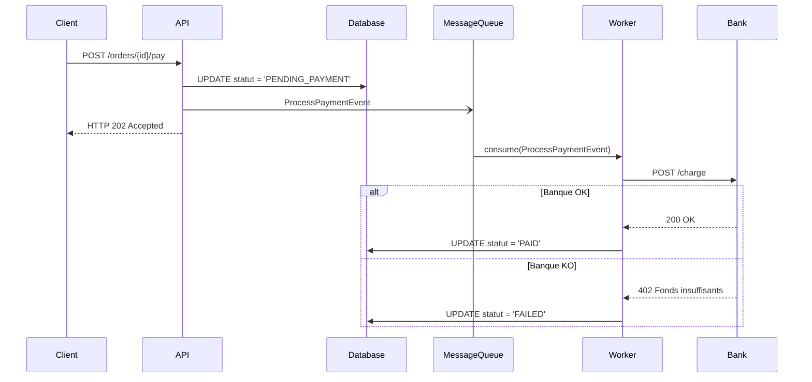

# Diagramme de séquence

```mermaid
sequenceDiagram
    participant Client
    participant API
    participant Database
    participant MessageQueue
    participant Worker
    participant Bank

    Client->>API: POST /orders/{id}/pay
    API->>Database: UPDATE statut = 'PENDING_PAYMENT'
    API-)MessageQueue: ProcessPaymentEvent
    API-->>Client: HTTP 202 Accepted
    MessageQueue->>Worker: consume(ProcessPaymentEvent)
    Worker->>Bank: POST /charge

    alt Banque OK
        Bank-->>Worker: 200 OK
        Worker->>Database: UPDATE statut = 'PAID'
    else Banque KO
        Bank-->>Worker: 402 Fonds insuffisants
        Worker->>Database: UPDATE statut = 'FAILED'
    end
```
